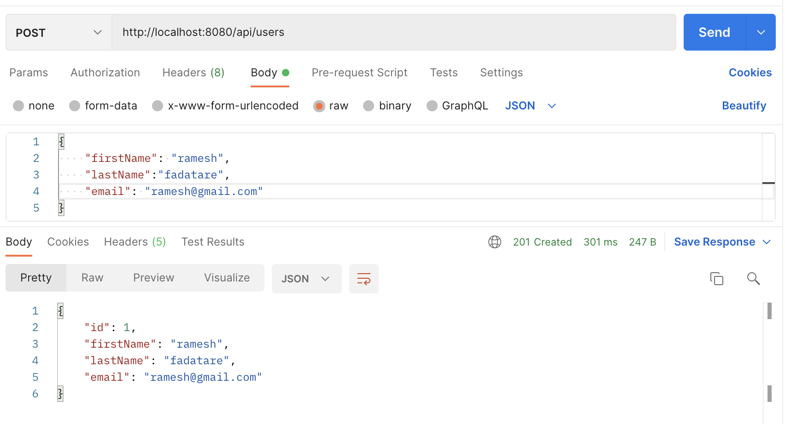

# 112981

# Lab 3: Objective of this lab

    - Develop web projects with Spring Boot. Create and persist entities into a relational database using Spring Data.
    - Deploy Spring Boot application in Docker.

## Table of Contents
   1. [Lab3_2_c Answers](#lab3_2_c-answers) 
   2. [Accessing Databases In SpringBoot](#accessing-databases-in-springboot) 
        - [Maven Dependencies](#maven-dependencies)  
        - [The Domain Layer](#the-domain-layer)  
        - [The Repository Layer](#the-repository-layer)  
        - [The Controller Layer](#the-controller-layer)  
        - [The View Layer](#the-view-layer)  
        - [Running the Application](#running-the-application)  
   3. [Multilayer Applications - Exposing Data With REST Interface](#multilayer-applications---exposing-data-with-rest-interface)  
        - [Setting Up MySQL Database with Docker](#setting-up-mysql-database-with-docker)  
        - [Configure MySQL Database](#configure-mysql-database) 
        - [Create JPA Entity](#create-jpa-entity)  
        - [Create Spring Data JPA Repository - UserRepository](#create-spring-data-jpa-repository---userrepository)  
        - [Create Service Layer](#create-service-layer) 
        - [Create Controller Layer - UserController](#create-controller-layer---usercontroller)  
        - [Running Spring Boot Application](#running-spring-boot-application)  
        - [Test CRUD RESTful WebServices using Postman Client](#test-crud-restful-webservices-using-postman-client)  
            - [Create User REST API](#create-user-rest-api)  
            - [Get User By ID REST API](#get-user-by-id-rest-api)  
            - [Update User REST API](#update-user-rest-api)  
            - [Get All Users REST API](#get-all-users-rest-api)  
            - [Delete User REST API](#delete-user-rest-api)  
        - [Create Simple Queries](#create-simple-queries)
        - [Spring `@RequestParam` Annotation](#spring-requestparam-annotation)
            - [A Simple Mapping](#a-simple-mapping)
            - [Specifying the Request Parameter Name](#specifying-the-request-parameter-name)
            - [Optional Request Parameters](#optional-request-parameters)
            - [A Default Value for the Request Parameter](#a-default-value-for-the-request-parameter)
            - [Mapping All Parameters](#mapping-all-parameters)
            - [Mapping a Multi-Value Parameter](#mapping-a-multi-value-parameter)  

---

Let me know if you need any further adjustments!

## Lab3_2_c Answers

### 1. **The “UserController” class gets an instance of “userRepository” through its constructor; how is this new repository instantiated?**
   
The `UserController` class gets an instance of `userRepository` through **constructor injection**:
```java
public UserController(UserRepository userRepository) {
    this.userRepository = userRepository;
}
```
- This is managed by **Spring's Dependency Injection (DI)** mechanism. 
- **Spring Boot** automatically instantiates the `UserRepository` bean and injects it into the controller, because the `UserRepository` interface is annotated with `@Repository` and extends `CrudRepository`.
- Spring Boot uses **Autowiring** to find the implementation of `UserRepository` (which is generated by Spring Data JPA at runtime) and injects it into the `UserController`.

### 2. **List the methods invoked in the “userRepository” object by the “UserController”. Where are these methods defined?**

The methods invoked on `userRepository` in the `UserController` are:

- `findAll()` – Retrieves all users and is invoked in `showUserList()`:
   ```java
   model.addAttribute("users", userRepository.findAll());
   ```
  
- `save()` – Saves a new or updated `User` entity, and is invoked in `addUser()` and `updateUser()`:
   ```java
   userRepository.save(user);
   ```
  
- `findById()` – Retrieves a specific `User` entity by ID, and is invoked in `showUpdateForm()` and `deleteUser()`:
   ```java
   User user = userRepository.findById(id)
       .orElseThrow(() -> new IllegalArgumentException("Invalid user Id:" + id));
   ```

- `delete()` – Deletes a `User` entity by ID, and is invoked in `deleteUser()`:
   ```java
   userRepository.delete(user);
   ```

These methods are not explicitly defined in the `UserRepository` interface. Instead, they are inherited from the **`CrudRepository`** interface, which `UserRepository` extends. **Spring Data JPA** provides the implementation for these methods at runtime.

### 3. **Where is the data being saved?**

The data is being saved in a **database** configured in the **Spring Boot** application. 

- The `save()` method from `CrudRepository` is responsible for persisting the `User` entity to the database.
- The actual database (e.g., MySQL, H2, PostgreSQL) and its connection details (such as `URL`, `username`, and `password`) are usually defined in the **`application.properties`** or **`application.yml`** file in the Spring Boot project.
- By default, Spring Boot uses an embedded `H2 database` if no other database is specified.

### 4. **Where is the rule for the "not empty" email address defined?**

The rule for the "not empty" email address is defined in the **`User`** entity using the `@NotBlank` annotation:
```java
@NotBlank(message = "Email is mandatory")
private String email;
```

- The `@NotBlank` annotation is a **validation constraint** provided by **Jakarta Bean Validation** (formerly JSR-303/JSR-380). It ensures that the `email` field is not `null`, empty, or consists solely of whitespace.
- This validation is triggered in the `UserController` by the `@Valid` annotation in methods like `addUser()` and `updateUser()`:
```java
public String addUser(@Valid User user, BindingResult result, Model model) { ... }
```

If the validation fails (i.e., if the email is empty or blank), an error message is stored in `BindingResult`, and the user is redirected back to the form (`add-user` template) to correct their input.


## Accessing Databases In SpringBoot
#### Check full tutorial on: [Baeldung](https://www.baeldung.com/spring-boot-crud-thymeleaf)

- Spring Boot makes it easy to create CRUD applications through a layer of standard JPA-based CRUD repositories.
- We’ll learn how to develop a CRUD web application with Spring Boot and Thymeleaf.

### Maven Dependencies
    
- Using `spring-boot-starter-parent`, we won’t need to specify the versions of the project dependencies in our pom.xml file, except for overriding the Java version:
    
```xml
<parent>
    <groupId>org.springframework.boot</groupId>
    <artifactId>spring-boot-starter-parent</artifactId>
</parent>
<dependencies>
    <dependency>
        <groupId>org.springframework.boot</groupId>
        <artifactId>spring-boot-starter-web</artifactId>
    </dependency>
    <dependency>
        <groupId>org.springframework.boot</groupId>
        <artifactId>spring-boot-starter-thymeleaf</artifactId>
    </dependency>
    <dependency>
        <groupId>org.springframework.boot</groupId>
        <artifactId>spring-boot-starter-data-jpa</artifactId>
    </dependency>
    <dependency>
        <groupId>com.h2database</groupId>
        <artifactId>h2</artifactId>
    </dependency>
</dependencies>
```

### The Domain Layer

- For simplicity’s sake, this layer will include one single class that will be responsible for modeling `User` entities:

```java
@Entity
public class User {
    
    @Id
    @GeneratedValue(strategy = GenerationType.AUTO)
    private long id;
    
    @NotBlank(message = "Name is mandatory")
    private String name;
    
    @NotBlank(message = "Email is mandatory")
    private String email;

    // standard constructors / setters / getters / toString
}
```

- We’ve annotated the class with the `@Entity` annotation. 
- Therefore, the JPA implementation, which is `Hibernate`, in this case, will be able to perform `CRUD` operations on the `domain entities` (check [Hibernate 5 with Spring](https://www.baeldung.com/hibernate-spring)).
- We’ve also constrained the name and email fields with the @NotBlank constraint. 
- Now, we can use `Hibernate Validator` for validating the constrained fields before persisting or updating an entity in the database (check [associated tutorial on Bean Validation.](https://www.baeldung.com/?__im-QylvkzKT=13326264676159996055)).
    
### The Repository Layer

- Our sample web application doesn´t do anything yet.
- Spring Data JPA allows us to implement `JPA-based repositories` (a fancy name for the DAO pattern implementation) with minimal fuss (complicação).
- [Spring Data JPA](https://www.baeldung.com/the-persistence-layer-with-spring-data-jpa) is a key component of Spring Boot’s `spring-boot-starter-data-jpa`that makes it easy to add CRUD functionality through a powerful `layer of abstraction` placed on top of a JPA implementation. 
- It allows us to access the persistence layer without having to provide our own DAO implementations from scratch.
- To provide our application with basic `CRUD functionality` on `User object`s, we just need to `extend the CrudRepository interface`:

```java
@Repository
public interface UserRepository extends CrudRepository<User, Long> {}
```
    - With the CrudRepository interface, Spring Data JPA will provide implementations for the repository’s CRUD methods for us.

### The Controller Layer

- With the previous the `layer of abstraction`, we can easily add some CRUD functionality to our web application through a basic web tier.
- In this case, a `single controller class` will suffice for handling `GET` and `POST HTTP` requests and then mapping them to calls to our UserRepository implementation.
- With this said, yhe controller layer is responsible for `processing user requests` and `building appropriate responses`.
- The controller class relies on some of [Spring MVC’s](https://www.baeldung.com/spring-mvc-tutorial) key features.
- Let’s start with the following controller methods:

```java
@Controller
public class UserController {

    // We’ll need a mapping for the /index URL:
    @GetMapping("/index")
    public String showUserList(Model model) {
        model.addAttribute("users", userRepository.findAll());
        return "index";
    }
    
    // Display the user signup form
    @GetMapping("/signup")
    public String showSignUpForm(User user) {
        return "add-user";
    }
    
    // Persist a new entity in the database after validating the constrained fields
    @PostMapping("/adduser")
    public String addUser(@Valid User user, BindingResult result, Model model) {
        if (result.hasErrors()) {
            // If the entity doesn’t pass the validation, the signup form will be redisplayed
            return "add-user";
        }
        
        userRepository.save(user);
        return "redirect:/index";
    }

    // additional CRUD methods

    // We'll also need to fetch the User entity that matches the supplied id from the database.
    @GetMapping("/edit/{id}")
    public String showUpdateForm(@PathVariable("id") long id, Model model) {
        User user = userRepository.findById(id)
          .orElseThrow(() -> new IllegalArgumentException("Invalid user Id:" + id));

        // If the entity exists, it will be passed on as a model attribute to the update form view.
        // The form can be populated with the values of the name and email fields:
        model.addAttribute("user", user);
        return "update-user";
    }


    // Finally, we have the updateUser() and deleteUser() methods within the UserController class.
    // Persist the updated entity in the database
    @PostMapping("/update/{id}")
    public String updateUser(@PathVariable("id") long id, @Valid User user, 
      BindingResult result, Model model) {
        if (result.hasErrors()) {
            user.setId(id);
            return "update-user";
        }

        userRepository.save(user);
        return "redirect:/index";
    }

    // Remove the given entity
    @GetMapping("/delete/{id}")
    public String deleteUser(@PathVariable("id") long id, Model model) {
        User user = userRepository.findById(id)
          .orElseThrow(() -> new IllegalArgumentException("Invalid user Id:" + id));
        userRepository.delete(user);
        return "redirect:/index";
    }

}
```

### The View Layer

- There’s still a missing component in this schema: `the view layer`.
- Under the `src/main/resources/templates` folder, we need to `create the HTML templates` required for displaying the list of User entities and the signup and the update forms.
- We’ll use Thymeleaf as the underlying template engine for parsing the template files.
 
`add-user.html`
```html
<form action="#" th:action="@{/adduser}" th:object="${user}" method="post">
    <label for="name">Name</label>
    <input type="text" th:field="*{name}" id="name" placeholder="Name">
    <span th:if="${#fields.hasErrors('name')}" th:errors="*{name}"></span>
    <label for="email">Email</label>
    <input type="text" th:field="*{email}" id="email" placeholder="Email">
    <span th:if="${#fields.hasErrors('email')}" th:errors="*{email}"></span>
    <input type="submit" value="Add User">   
</form>
```
**Note**: *Notice how we’ve used the `@{/adduser}` URL expression to specify the `form’s action attribute` and the `${}` variable expressions for `embedding dynamic content` in the template, such as the `values of the name and email fields` and the `post-validation errors`.*

`update-user.html`
```html
<form action="#" 
  th:action="@{/update/{id}(id=${user.id})}" 
  th:object="${user}" 
  method="post">
    <label for="name">Name</label>
    <input type="text" th:field="*{name}" id="name" placeholder="Name">
    <span th:if="${#fields.hasErrors('name')}" th:errors="*{name}"></span>
    <label for="email">Email</label>
    <input type="text" th:field="*{email}" id="email" placeholder="Email">
    <span th:if="${#fields.hasErrors('email')}" th:errors="*{email}"></span>
    <input type="submit" value="Update User">   
</form>
```

`index.html` - Displays the list of persisted entities along with the links for editing and removing existing ones.
```html
<div th:switch="${users}">
    <h2 th:case="null">No users yet!</h2>
        <div th:case="*">
            <h2>Users</h2>
            <table>
                <thead>
                    <tr>
                        <th>Name</th>
                        <th>Email</th>
                        <th>Edit</th>
                        <th>Delete</th>
                    </tr>
                </thead>
                <tbody>
                <tr th:each="user : ${users}">
                    <td th:text="${user.name}"></td>
                    <td th:text="${user.email}"></td>
                    <td><a th:href="@{/edit/{id}(id=${user.id})}">Edit</a></td>
                    <td><a th:href="@{/delete/{id}(id=${user.id})}">Delete</a></td>
                </tr>
            </tbody>
        </table>
    </div>      
    <p><a href="/signup">Add a new user</a></p>
</div>
```

- To give the templates an improved, eye-catching look without spending too much time on HTML/CSS, we can easily use a free [Twitter Bootstrap UI kit](https://getbootstrap.com/), such as [Shards](https://designrevision.com/downloads/shards/).

### Running the Application

- Let’s define the application’s entry point.
- Like most Spring Boot applications, we can do this with a `main()` method:
    
```java
@SpringBootApplication
public class Application {

    public static void main(String[] args) {
        SpringApplication.run(Application.class, args);
    }
}
```

- We can now run the application by executing the `main()` method.

```bash
mvn clean package
mvn exec:java -Dexec.mainClass="ies.lab3.ex1.lab3_1.JpaApplication"
```

- The application will be available at `http://localhost:8080/index`. **In the exercise of the lab: `http://127.0.0.1:8080/api/employees`**
- We should see a basic CRUD user dashboard with links for adding new entities and for editing and removing existing ones.


## Multilayer Applications - Exposing Data With REST Interface 

- In this exercise, we'll need an instance of MySQL server (v5.7).
- For that, we can use a container:

### Setting Up MySQL Database with Docker

```bash
docker run --name mysql5 -e MYSQL_ROOT_PASSWORD=secret1 -e MYSQL_DATABASE=demo -e MYSQL_USER=demo -e MYSQL_PASSWORD=secret2 -p 33060:3306 -d mysql/mysql-server:5.7
```

#### Check full tutorial on: [javaguides.net](https://www.javaguides.net/2018/09/spring-boot-2-jpa-mysql-crud-example.html) (scroll down)

- Learn how to build CRUD RESTful API using Spring Boot 3, Spring Data JPA (Hibernate), and MySQL database
- We are going to use `three-layer architecture` in our Spring boot project:   
 

### Create and Setup Spring Boot Project (Spring Initializr)
- Project Structure:  


### Configure MySQL Database

- Create a database: Go to MySQL workbench, and use the below SQL query to create a new database
    
```sql
CREATE DATABASE demo;
```

- Next, open the [application.properties](https://howtodoinjava.com/spring-boot2/datasource-configuration/#configurations) (2.2) file and add the following properties to it:

```bash
# MySQL
spring.datasource.url=jdbc:mysql://127.0.0.1:33060/demo
spring.datasource.username=demo
spring.datasource.password=secret2

# Spring Boot uses Hibernate as the default JPA implementation.
spring.jpa.database-platform=org.hibernate.dialect.MySQLDialect

# Strategy to auto update the schemas  (create, create-drop, validate, update) and
# create the database tables automatically
spring.jpa.hibernate.ddl-auto = update
```

- Make sure that you change the `spring.datasource.username` & `spring.datasource.password` properties as per your MySQL installation.

### Create JPA Entity

- `An Entity` is a plain old Java object (POJO) that `represents the data you want to store`.
- You will need to annotate the class with `@Entity` and define the `fields` of the class along with the `getters and setters` for each field.

```java
import jakarta.persistence.*;
import lombok.AllArgsConstructor;
import lombok.Getter;
import lombok.NoArgsConstructor;
import lombok.Setter;

@Getter
@Setter
@NoArgsConstructor
@AllArgsConstructor
@Entity
@Table(name = "users")
public class User {

    @Id
    @GeneratedValue(strategy = GenerationType.IDENTITY)
    private Long id;

    @Column(nullable = false)
    private String firstName;

    @Column(nullable = false)
    private String lastName;

    @Column(nullable = false, unique = true)
    private String email;
}
```

- This case uses `Lombok` annotations to reduce the `boilerplate` code `(getters/setters)`.

### Create Spring Data JPA Repository - UserRepository

- A `repository` is an `interface` that `defines the methods for performing CRUD operations on the Entity`.
- `Spring Data JPA` will automatically create the implementation for the Repository interface.
- Let's create a `UserRepository` interface that `extends JpaRepository`

```java
import net.javaguides.springboot.entity.User;
import org.springframework.data.jpa.repository.JpaRepository;

public interface UserRepository extends JpaRepository<User, Long> {

}
```

- In this case, they don´t use `@Repository`, because it is not necessary, since `Spring Data JPA internally takes care of it`.

### Create Service Layer

- This layer will contain the `business logic` for the API and `will be used to perform CRUD operations` using the Repository.
- To implement the service layer, we will `first create an interface` and `then its implementation class`.

#### Service Interface - UserService

- Declare the following CRUD methods:

```java
import net.javaguides.springboot.entity.User;
import java.util.List;

public interface UserService {
    User createUser(User user);
    User getUserById(Long userId);
    List<User> getAllUsers();
    User updateUser(User user);
    void deleteUser(Long userId);
}
```

#### Service Implementation - UserServiceImpl

```java
import lombok.AllArgsConstructor;
import net.javaguides.springboot.entity.User;
import net.javaguides.springboot.repository.UserRepository;
import net.javaguides.springboot.service.UserService;
import org.apache.logging.log4j.util.Strings;
import org.springframework.stereotype.Service;
import org.springframework.util.StringUtils;

import java.util.List;
import java.util.Objects;
import java.util.Optional;

@Service
@AllArgsConstructor
public class UserServiceImpl implements UserService {

    private UserRepository userRepository;

    @Override
    public User createUser(User user) {
        return userRepository.save(user);
    }

    @Override
    public User getUserById(Long userId) {
        Optional<User> optionalUser = userRepository.findById(userId);
        return optionalUser.get();
    }

    @Override
    public List<User> getAllUsers() {
        return userRepository.findAll();
    }

    @Override
    public User updateUser(User user) {
        User existingUser = userRepository.findById(user.getId()).get();
        existingUser.setFirstName(user.getFirstName());
        existingUser.setLastName(user.getLastName());
        existingUser.setEmail(user.getEmail());
        User updatedUser = userRepository.save(existingUser);
        return updatedUser;
    }

    @Override
    public void deleteUser(Long userId) {
        userRepository.deleteById(userId);
    }
}
```

### Create Controller Layer - UserController

- We’ll now create the `REST APIs for creating, retrieving, updating, and deleting` a `User` resource.

```java
import lombok.AllArgsConstructor;
import net.javaguides.springboot.entity.User;
import net.javaguides.springboot.service.UserService;
import org.springframework.http.HttpStatus;
import org.springframework.http.ResponseEntity;
import org.springframework.web.bind.annotation.*;

import java.util.List;

@RestController
@AllArgsConstructor
@RequestMapping("api/users")
public class UserController {

    private UserService userService;

    // Build POST create User REST API
    @PostMapping
    public ResponseEntity<User> createUser(@RequestBody User user){
        User savedUser = userService.createUser(user);
        return new ResponseEntity<>(savedUser, HttpStatus.CREATED);
    }

    // Build GET user BY ID REST API
    // http://localhost:8080/api/users/1 -> 1 == {id}
    @GetMapping("{id}")
    public ResponseEntity<User> getUserById(@PathVariable("id") Long userId){
        User user = userService.getUserById(userId);
        return new ResponseEntity<>(user, HttpStatus.OK);
    }

    // Build GET ALL Users REST API
    // http://localhost:8080/api/users
    @GetMapping
    public ResponseEntity<List<User>> getAllUsers(){
        List<User> users = userService.getAllUsers();
        return new ResponseEntity<>(users, HttpStatus.OK);
    }

    // Build PUT Update User REST API
    @PutMapping("{id}")
    // http://localhost:8080/api/users/1
    public ResponseEntity<User> updateUser(@PathVariable("id") Long userId,
                                           @RequestBody User user){
        user.setId(userId);
        User updatedUser = userService.updateUser(user);
        return new ResponseEntity<>(updatedUser, HttpStatus.OK);
    }

    // Build DELETE User REST API
    @DeleteMapping("{id}")
    public ResponseEntity<String> deleteUser(@PathVariable("id") Long userId){
        userService.deleteUser(userId);
        return new ResponseEntity<>("User successfully deleted!", HttpStatus.OK);
    }
}
```

- Annotation `@AllArgsConstructor` is used to generate a constructor automatically with all the fields of the class.


### Running Spring Boot Application

- Run the `Application.main()` method as a standalone Java class that will start the embedded `Tomcat server` on port 8080 and point the browser to `http://localhost:8080/` (change the address and port as you need).

- To do so, go to the root directory of the application and type the following command to run it -

```bash
mvn spring-boot:run 
```

### Test CRUD RESTful WebServices using `Postman Client`

#### Create User REST API:

- `Request URL`: http://localhost:8080/api/users
- `HTTP Method:` POST
- `Request Body:`

```json
{
    "firstName": "ramesh",
    "lastName":"fadatare",
    "email": "ramesh@gmail.com"
}
```

 


#### Get User By ID REST API:

- `Request URL:` http://localhost:8080/api/users/1
- `HTTP Method:` GET


#### Update User REST API:

- `Request URL:` http://localhost:8080/api/users/1
- `HTTP Method:` PUT
- `Request Body:`

```json
{
    "firstName": "ram",
    "lastName":"fadatare",
    "email": "ram@gmail.com"
}
```


#### Get All Users REST API:

- `Request URL:` http://localhost:8080/api/users
- `HTTP Method:` GET

  


#### Delete User REST API:

- `Request URL:` http://localhost:8080/api/users/1
- `HTTP Method:` DELETE


### [Create Simple Queries](https://spring.io/guides/gs/accessing-data-jpa#_create_simple_queries) 

```java
import java.util.List;
import org.springframework.data.repository.CrudRepository;

public interface CustomerRepository extends CrudRepository<Customer, Long> {
  List<Customer> findByLastName(String lastName);
  Customer findById(long id);
}
```

- I the case above, `CustomerRepository` extends the `CrudRepository` interface. 
- The `type of entity` and `ID` that it works with, Customer and Long, `are specified in the generic parameters` on CrudRepository. 
- By `extending CrudRepository`, CustomerRepository `inherits several methods for working with Customer persistence`, (CRUD) including methods for saving, deleting, and finding Customer entities.
- **Spring Data JPA also lets you define `other query methods` by declaring their method signature.**
- **For example, CustomerRepository includes the `findByLastName()` method.**
- In a typical Java application, you might expect to `write a class that implements CustomerRepository`.
- However, that is what makes Spring Data JPA so powerful: **`You don’t have to write an implementation of the repository interface`**.
- **Spring Data JPA creates an implementation when you run the application.**

### [Spring `@RequestParam` Annotation](https://www.baeldung.com/spring-request-param)

#### A Simple Mapping

- We can use `@RequestParam` to `extract query parameters`, `form parameters`, and even `files` from the request.
- For example, we have an endpoint `/api/foos` that takes a query parameter called `id`:

```java
@GetMapping("/api/foos")
@ResponseBody
public String getFoos(@RequestParam String id) {
    return "ID: " + id;
}
```

- In this example, we used @RequestParam to extract the id query parameter.
- A simple GET request would invoke getFoos:

```bash
http://localhost:8080/spring-mvc-basics/api/foos?id=abc
----
ID: abc
```

#### Specifying the Request Parameter Name

- In the previous example, both the variable name and the parameter name are the same (id).
- Sometimes we want these to be different, though.
- we can configure the @RequestParam name using the name attribute:

```java
@PostMapping("/api/foos") // -> http://localhost:8080/spring-mvc-basics/api/foos?id=abc&name=def
@ResponseBody
public String addFoo(@RequestParam(name = "id") String fooId, @RequestParam String name) { 
    return "ID: " + fooId + " Name: " + name;
}
```

or 

```java
@PostMapping("/api/foos") // -> http://localhost:8080/spring-mvc-basics/api/foos?id=abc&name=def
@ResponseBody
public String addFoo(@RequestParam(value = “id”)  String fooId, @RequestParam String name) { 
    return "ID: " + fooId + " Name: " + name;
}
```

or

```java
@PostMapping("/api/foos") // -> http://localhost:8080/spring-mvc-basics/api/foos?id=abc&name=def
@ResponseBody
public String addFoo(@RequestParam(“id”).  String fooId, @RequestParam String name) { 
    return "ID: " + fooId + " Name: " + name;
}
```

#### Optional Request Parameters

- Method parameters annotated with @RequestParam are `required by default`.
- if the parameter isn’t present in the request, we’ll get an error: "*Required String parameter 'id' is not present*"
- We can configure our @RequestParam to be optional with the `required` attribute:

```java
@GetMapping("/api/foos")
@ResponseBody
public String getFoos(@RequestParam(name= "id", required = false) String fooId) { 
    return "ID: " + fooId;
}
```

- Alternatively, we can wrap the parameter in `Optional`:

```java
@GetMapping("/api/foos")
@ResponseBody
public String getFoos(@RequestParam Optional<String> id){
    return "ID: " + id.orElseGet(() -> "not provided");
}
```

- In this case, we don’t need to specify the `required` attribute.

#### A Default Value for the Request Parameter

- We can also set a default value to the @RequestParam by using the `defaultValue` attribute:

```java
@GetMapping("/api/foos")
@ResponseBody
public String getFoos(@RequestParam(defaultValue = "test") String id) {
    return "ID: " + id;
}
```

#### Mapping All Parameters

- We can also have multiple parameters without defining their names or count by just using a `Map`:

```java
@PostMapping("/api/foos")
@ResponseBody
public String updateFoos(@RequestParam Map<String,String> allParams) {
    return "Parameters are " + allParams.entrySet();
}
```

```bash
curl -X POST -F 'name=abc' -F 'id=123' http://localhost:8080/spring-mvc-basics/api/foos
-----
Parameters are {[name=abc], [id=123]}
```

#### Mapping a Multi-Value Parameter

- A single @RequestParam can have `multiple values`:

```java
@GetMapping("/api/foos")
@ResponseBody
public String getFoos(@RequestParam List<String> id) {
    return "IDs are " + id;
}
```

```bash
http://localhost:8080/spring-mvc-basics/api/foos?id=1,2,3
----
IDs are [1,2,3]
```
or
```bash
http://localhost:8080/spring-mvc-basics/api/foos?id=1&id=2
----
IDs are [1,2]
```

## Wrapping-up and integrating concepts 

### **Question**

```txt
package ies.lab3.ex3;

import org.springframework.data.jpa.repository.JpaRepository;
import org.springframework.stereotype.Repository;
import java.util.List;

@Repository
public interface MovieRepository extends JpaRepository<Movie, Long> {
    List<Movie> findMoviesByYear(String year);
}

"How does the repository know that I want to search by year and not, e.g., by title, since they are both String?"
```

### **Answer:**

In Spring Data JPA, the repository method naming convention is key. The method `findMoviesByYear` follows a specific naming pattern that Spring interprets to generate the appropriate query based on the field name `year` in your `Movie` entity.

#### How It Works

1. **Naming Convention**:
   - In the method name `findMoviesByYear`, the `ByYear` part tells Spring Data JPA to look for a field named `year` in the `Movie` entity.
   - The naming convention `findBy<FieldName>` (or `findMoviesBy<FieldName>`) is automatically parsed by Spring to generate a query based on the specified field.

2. **Field Matching**:
   - When Spring encounters `ByYear`, it searches the `Movie` entity class for a field named `year`. 
   - Similarly, if you had a method like `findMoviesByTitle`, Spring would interpret it as a query based on a `title` field in `Movie`.

3. **Dynamic Query Generation**:
   - Spring Data JPA translates `findMoviesByYear` into a query like `SELECT m FROM Movie m WHERE m.year = :year`, where `:year` is the method parameter.
   - This dynamic query generation allows you to use simple methods in the repository interface without writing explicit query code.

#### Example

Assume your `Movie` entity has the following fields:

```java
@Entity
public class Movie {
    private Long id;
    private String title;
    private String year;
    // other fields, getters, setters
}
```

For `MovieRepository`, if you add methods like:

```java
List<Movie> findMoviesByTitle(String title);
List<Movie> findMoviesByYear(String year);
```

- `findMoviesByTitle` will query by the `title` field.
- `findMoviesByYear` will query by the `year` field.

#### Custom Queries with Annotations (Optional)

If you need a more complex query or don't want to rely on the naming convention, you can use the `@Query` annotation:

```java
@Query("SELECT m FROM Movie m WHERE m.year = :year")
List<Movie> findMoviesByYear(@Param("year") String year);
```

This way, you have control over the exact query, though it’s usually not necessary for simple lookups. 
