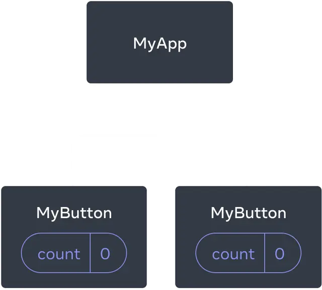
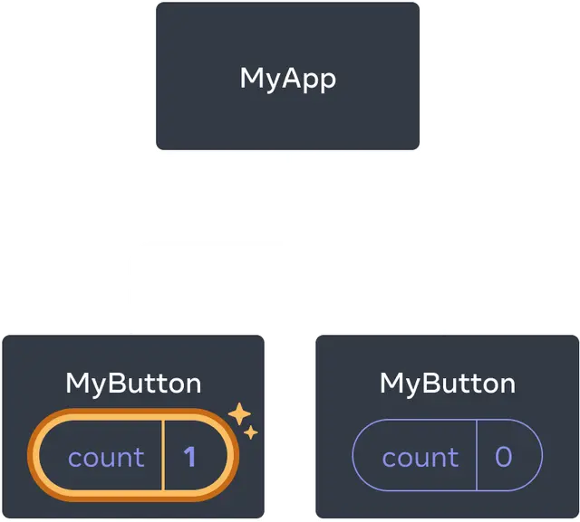
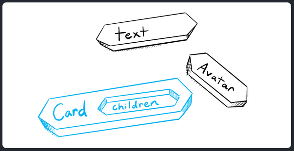

# 112981

# Lab 4: Objective of this lab

    - Develop web projects with Spring Boot. 
    - Create and persist entities into a relational database using Spring Data.
    - Deploy Spring Boot application in Docker.

## Table of Contents

1. [ReactJS + Vite](#reactjs--vite)
  - [Create project](#create-project)
  - [Install Dependencies](#install-dependencies)
  - [Run Project](#run-project)
2. [First Dummy App - Quick Start](#first-dummy-app---quick-start)
  - [Creating and nesting components](#creating-and-nesting-components)
  - [Writing markup with JSX](#writing-markup-with-jsx)
  - [Adding styles](#adding-styles)
  - [Conditional rendering](#conditional-rendering)
  - [Rendering lists](#rendering-lists)
  - [Responding to events](#responding-to-events)
  - [Updating the screen](#updating-the-screen)
  - [Using Hooks](#using-hooks)
  - [Sharing data between components](#sharing-data-between-components)
3. [Props and States](#props-and-states)
  - [Passing Props to a Component](#passing-props-to-a-component)
  - [Updating Objects in State](#updating-objects-in-state)
  - [Passing Data Deeply with Context](#passing-data-deeply-with-context)


## ReactJS + Vite

### Create project

```bash
npm create vite@latest
```

### Install Dependencies

```bash
npm install
```

### Run Project

```bash
npm run dev
```

## First Dummy App - [Quick Start](https://react.dev/learn)

### Creating and nesting components 

- React apps are made out of **components**. 
- A component is a piece of the UI (user interface) that has its own logic and appearance. 
- A component can be as small as a button, or as large as an entire page.
- React components are **JavaScript/TypeScript functions** that return markup
- React **component** names must always **start with a capital letter**, while **HTML tags** must be **lowercase**.
- `export default` keywords specify the **main component in the file**; check [MDN](https://developer.mozilla.org/en-US/docs/web/javascript/reference/statements/export) and [javascript.info](https://javascript.info/import-export)


```tsx
function MyButton() {
  return (
    <button>
      I'm a button
    </button>
  );
}

export default function MyApp() {
  return (
    <div>
      <h1>Welcome to my app</h1>
      <MyButton />
    </div>
  );
}
```

### Writing markup with JSX 
- The markup syntax JSX is optional, but most React projects use JSX for its convenience.
- In JSX the components can’t return multiple JSX tags; you have to wrap them into a shared parent, like a `<div>...</div>` or an empty `<>...</>` wrapper (a fragment).

### Adding styles 
- You can specify a CSS class with `className`; it works the same way as the HTML `class` attribute
- Then you write the CSS rules for it in a **separate CSS file**
- Then, to use the styles in your component, you import the CSS file (relative path) at the top of the component file.
- You can also “escape into JavaScript” from JSX attributes, **but you have to use curly braces instead of quotes**.   
  
For example, `className="avatar"` passes the "avatar" string as the CSS class, but `src={user.imageUrl}` reads the `JavaScript` user.imageUrl variable value, and then passes that value as the src attribute:

```jsx
const user = {
  name: 'Hedy Lamarr',
  imageUrl: 'https://i.imgur.com/yXOvdOSs.jpg',
  imageSize: 90,
};

export default function Profile() {
  return (
    <>
      <h1>{user.name}</h1>
      
    </>
  );
}
```

### Conditional rendering 

- You can use an `if` statement to conditionally include JSX
- You can use the conditional `?` operator. Unlike if, **it works inside JSX**
- When you don’t need the `else` branch, you can also use a shorter logical `&&` syntax


### Rendering lists

- You will rely on JavaScript features like `for` loop and the array `map()` function to render lists of components
- Inside your component, use the `map()` function to **transform an array of products into an array of <li> items**
- <li> has a `key` attribute
- For each item in a **list**, you should **pass a string or a number that uniquely identifies that item** among its siblings. 

```tsx
const products = [
  { title: 'Cabbage', isFruit: false, id: 1 },
  { title: 'Garlic', isFruit: false, id: 2 },
  { title: 'Apple', isFruit: true, id: 3 },
];

export default function ShoppingList() {
  const listItems = products.map(product =>
    <li
      key={product.id}
      style={{
        color: product.isFruit ? 'magenta' : 'darkgreen'
      }}
    >
      {product.title}
    </li>
  );

  return (
    <ul>{listItems}</ul>
  );
}
```

### Responding to events 

- You can respond to **events** by declaring **event handler functions** inside your components
- `onClick={handleClick}` has no parentheses at the end (handleClick`()`)! **Do not call the event handler function**: you only need to pass it down. React will call your event handler when the user clicks the button.


### Updating the screen

- Often, you’ll want your component to **“remember” some information and display it**. 
- For example, maybe you want to count the number of times a button is clicked. 
- **To do this, add `state` to your component**.
- First, import `useState` from React
- Then you can **declare a state variable** inside your component
- **You’ll get two things from `useState`: the `current state` (count), and the `function that lets you update it` (setCount).** 
- You can give them any names, but the convention is to write [something, setSomething].
- The value that is passed as an argument to `useState()` is the value with which the variabe (something) is initialized.
- When you want to change state, call setSomething() and pass the new value to it.
- The first time the button is displayed, count will be 0 **because you passed 0 to useState()**.
- If you render the same component multiple times, **each will get its own state**. 


```tsx
import { useState } from 'react';

export default function MyApp() {
  return (
    <div>
      <h1>Counters that update separately</h1>
      <MyButton />
      <MyButton />
    </div>
  );
}

function MyButton() {
  const [count, setCount] = useState(0);

  function handleClick() {
    setCount(count + 1);
  }

  return (
    <button onClick={handleClick}>
      Clicked {count} times
    </button>
  );
}
```


### Using Hooks

- Functions starting with `use` are called **Hooks**. 
- `useState` is a built-in Hook provided by React. 
- You can find other built-in Hooks in this [API reference](https://react.dev/reference/react). 
- You can also write your own Hooks by combining the existing ones.


### Sharing data between components 

 
- Initially, each MyButton’s count state is 0
 
- The first MyButton updates its count to 1
  
- Often you’ll need components to share data and always **update together**.
- To make both `MyButton` components display the same count and **update together**, you need to **move the state from the individual buttons “upwards” to the closest component containing all of them**.
- In this example, it is `MyApp`:

 
- Initially, `MyApp`’s count state is 0 and **is passed down to both children**
 
- On click, `MyApp` updates its count state to 1 **and passes it down to both children**

- Now when you click either button, the count in `MyApp` will change,**which will change both of the counts in `MyButton`**. 

- As you can see: pass the state down from `MyApp` to each `MyButton`, **together with the shared click handler**. 
- You can pass information to `MyButton` using the JSX curly braces, just like you previously did with built-in tags like ``

- The information you pass down like this is called `props`. 
- Now the `MyApp` component **contains the count state and the handleClick event handler, and passes both of them down as props to each of the buttons**.
- Finally, change `MyButton` to read the `props` you have passed from its parent component

```tsx
export default function MyApp() {
  // ======= To here =========
  const [count, setCount] = useState(0);

  function handleClick() {
    setCount(count + 1);
  }

  // =========================

  return (
    <div>
      <h1>Counters that update together</h1>
      <MyButton count={count} onClick={handleClick} />
      <MyButton count={count} onClick={handleClick} />
    </div>
  );
}

function MyButton() {
  // ================
  // ... we're moving code from here ...
  // ================
    return (
    <button onClick={onClick}>
      Clicked {count} times
    </button>
  );

}
```


## Props and States

### [Passing Props to a Component](https://react.dev/learn/passing-props-to-a-component)


#### Familiar props

- **Props** are the information that you pass to a JSX tag. 
- For example, `className`, `src`, `alt`, `width`, and `height` are some of the props you can pass to an ``:

```tsx
function Avatar() {
  return (
    
  );
}

export default function Profile() {
  return (
    <Avatar />
  );
}
```

#### Passing props to a component 

1. First, pass some props to `Avatar`. 
  - For example, let’s pass two props: person (`an object`), and size (a number):

```tsx
export default function Profile() {
  return (
    <Avatar
      person={{ name: 'Lin Lanying', imageId: '1bX5QH6' }}
      size={100}
    />
  );
}
```

**Note**: Remember that double braces after `person=` merely represents an **object** in the usual JSX curly braces.

2. Read props inside the child component 

- To read the props inside the `Avatar` component, you need to **declare a function with a parameter**.

```tsx
function Avatar({ person, size }) {
  // person and size are available here
}
```

- Using different props:

```tsx
import { getImageUrl } from './utils.js';

function Avatar({ person, size }) {
  return (
    
  );
}

export default function Profile() {
  return (
    <div>
      <Avatar
        size={100}
        person={{ 
          name: 'Katsuko Saruhashi', 
          imageId: 'YfeOqp2'
        }}
      />
      <Avatar
        size={80}
        person={{
          name: 'Aklilu Lemma', 
          imageId: 'OKS67lh'
        }}
      />
      <Avatar
        size={50}
        person={{ 
          name: 'Lin Lanying',
          imageId: '1bX5QH6'
        }}
      />
    </div>
  );
}
```

```tsx
// props destructured in separate items
function Avatar({ person, size }) {
  // ...
}

// object props
function Avatar(props) {
  let person = props.person;
  let size = props.size;
  // ...
}
```

#### Specifying a default value for a prop 

```tsx
function Avatar({ person, size = 100 }) {
  // ...
}
```

#### Forwarding props with the JSX spread syntax 

- Sometimes, passing props gets very repetitive:

```tsx
function Profile({ person, size, isSepia, thickBorder }) {
  return (
    <div className="card">
      <Avatar
        person={person}
        size={size}
        isSepia={isSepia}
        thickBorder={thickBorder}
      />
    </div>
  );
}
```

- To do this, you can use the **JSX spread syntax**.

```tsx
function Profile(props) {
  return (
    <div className="card">
      <Avatar {...props} />
    </div>
  );
}
```

#### Passing JSX as children 

- It is common to nest built-in browser tags:

```tsx
<div>
  
</div>
```

Sometimes you’ll want to nest your own components the same way:

```tsx
<Card>
  <Avatar />
</Card>
```

- When you nest content inside a JSX tag, **the parent component will receive that content in a `prop` called children**. 
- For example, the `Card` component below will receive a `children prop` set to `<Avatar />` and render it in a **wrapper div**:

```tsx
import Avatar from './Avatar.js';

function Card({ children }) {
  return (
    <div className="card">
      {children}
    </div>
  );
}

export default function Profile() {
  return (
    <Card>
      <Avatar
        size={100}
        person={{ 
          name: 'Katsuko Saruhashi',
          imageId: 'YfeOqp2'
        }}
      />
    </Card>
  );
}
```

- Try replacing the `<Avatar>` inside `<Card>` with some `text` to see how the Card component can wrap any nested content. 
- **It doesn’t need to “know” what’s being rendered inside of it**. 
- You can think of a component with a children prop as having a “hole” that can be “filled in” by its parent components with arbitrary JSX 
- Examples of use: panels, grids, etc.




#### How props change over time 

- **A component may receive different props over time.** 
- Props are not always **static**! 
- Props reflect a component’s data at any point in time, rather than only in the beginning.
- However, props are immutable.
- When you need to **respond to the user input** (like changing the selected color), you will need to “`set state`”.


### [Updating Objects in State](https://react.dev/learn/updating-objects-in-state)

#### What’s a mutation? 

```tsx
const [position, setPosition] = useState({ x: 0, y: 0 });
```

- It is possible to change the contents of the object itself. This is called a **mutation**:

```tsx
position.x = 5;
position.y = 0;
```

- But to actually change and render the state of a component, you need to call the `setPosition` function:

```tsx
setPosition({ x: 5, y: 0 });
```

- With setPosition, you’re telling React:
  - Replace `position` with this new object
  - And **render this component again**

- The following code creates a red dot that moves according to the cursor:

```tsx
import { useState } from 'react';

export default function Form() {
  const [person, setPerson] = useState({
    firstName: 'Barbara',
    lastName: 'Hepworth',
    email: 'bhepworth@sculpture.com'
  });

  function handleFirstNameChange(e) {
    person.firstName = e.target.value;
  }

  function handleLastNameChange(e) {
    person.lastName = e.target.value;
  }

  function handleEmailChange(e) {
    person.email = e.target.value;
  }

  return (
    <>
      <label>
        First name:
        <input
          value={person.firstName}
          onChange={handleFirstNameChange}
        />
      </label>
      <label>
        Last name:
        <input
          value={person.lastName}
          onChange={handleLastNameChange}
        />
      </label>
      <label>
        Email:
        <input
          value={person.email}
          onChange={handleEmailChange}
        />
      </label>
      <p>
        {person.firstName}{' '}
        {person.lastName}{' '}
        ({person.email})
      </p>
    </>
  );
}
```

#### Copying objects with the spread syntax

- Analyze the following code:

```tsx
import { useState } from 'react';

export default function Form() {
  const [person, setPerson] = useState({
    firstName: 'Barbara',
    lastName: 'Hepworth',
    email: 'bhepworth@sculpture.com'
  });

  function handleFirstNameChange(e: React.ChangeEvent<HTMLInputElement>) {
    setPerson({
      ...person,
      firstName: e.target.value
    });
  }

  function handleLastNameChange(e: React.ChangeEvent<HTMLInputElement>) {
    setPerson({
      ...person,
      lastName: e.target.value
    });
  }

  function handleEmailChange(e: React.ChangeEvent<HTMLInputElement>) {
    setPerson({
      ...person,
      email: e.target.value
    });
  }

  return (
    <>
      <label>
        First name:
        <input
          value={person.firstName}
          onChange={handleFirstNameChange}
        />
      </label>
      <label>
        Last name:
        <input
          value={person.lastName}
          onChange={handleLastNameChange}
        />
      </label>
      <label>
        Email:
        <input
          value={person.email}
          onChange={handleEmailChange}
        />
      </label>
      <p>
        {person.firstName}{' '}
        {person.lastName}{' '}
        ({person.email})
      </p>
    </>
  );
}
```

- **The spread syntax** (`...person`) creates a new object with all the properties of the `person` object.
- Then you can **overwrite** the property you want to change.
- **This way, you’re not mutating the original object**.
- **You’re creating a new object with the same properties, except for the one you want to change**.
- **This is the recommended way to update objects in state**.
- Notice how you didn’t declare a **separate state variable for each input field**. 
- For large forms, keeping all data grouped in an object is very convenient - as long as you update it correctly!


#### Updating a nested object

- Consider a nested object structure like this:

```tsx
const [person, setPerson] = useState({
  name: 'Niki de Saint Phalle',
  artwork: {
    title: 'Blue Nana',
    city: 'Hamburg',
    image: 'https://i.imgur.com/Sd1AgUOm.jpg',
  }
});
```

- If you wanted to update person.artwork.city: 

```tsx
setPerson({
  ...person,            // Copy other fields
  artwork: {            // but replace the artwork
    ...person.artwork,  // with the same one
    city: 'New Delhi'   // but in New Delhi!
  }
});
```

```tsx
import { useState } from 'react';

export default function Form() {
  const [person, setPerson] = useState({
    name: 'Niki de Saint Phalle',
    artwork: {
      title: 'Blue Nana',
      city: 'Hamburg',
      image: 'https://i.imgur.com/Sd1AgUOm.jpg',
    }
  });

  function handleNameChange(e: React.ChangeEvent<HTMLInputElement>) {
    setPerson({
      ...person,
      name: e.target.value
    });
  }

  function handleTitleChange(e: React.ChangeEvent<HTMLInputElement>) {
    setPerson({
      ...person,
      artwork: {
        ...person.artwork,
        title: e.target.value
      }
    });
  }

  function handleCityChange(e: React.ChangeEvent<HTMLInputElement>) {
    setPerson({
      ...person,
      artwork: {
        ...person.artwork,
        city: e.target.value
      }
    });
  }

  function handleImageChange(e: React.ChangeEvent<HTMLInputElement>) {
    setPerson({
      ...person,
      artwork: {
        ...person.artwork,
        image: e.target.value
      }
    });
  }

  return (
    <>
      <label>
        Name:
        <input
          value={person.name}
          onChange={handleNameChange}
        />
      </label>
      <label>
        Title:
        <input
          value={person.artwork.title}
          onChange={handleTitleChange}
        />
      </label>
      <label>
        City:
        <input
          value={person.artwork.city}
          onChange={handleCityChange}
        />
      </label>
      <label>
        Image:
        <input
          value={person.artwork.image}
          onChange={handleImageChange}
        />
      </label>
      <p>
        <i>{person.artwork.title}</i>
        {' by '}
        {person.name}
        <br />
        (located in {person.artwork.city})
      </p>
      
    </>
  );
}
```

### [Passing Data Deeply with Context](https://react.dev/learn/passing-data-deeply-with-context)

- Usually, you will pass information **from a parent** component **to a child** component **via props**. 
- But passing props can become verbose and inconvenient **if you have to pass them through many components in the middle**, or **if many components in your app need the same information**. 
- **`Context`** **lets the parent component make some information available to any component in the tree below it** - no matter how deep - **without passing it explicitly through props**.


Lifting state up:


Prop drilling:


#### Context: an alternative to passing props

- Consider this `Heading` component that accepts a level for its size:

```tsx
import Heading from './Heading.js';
import Section from './Section.js';

export default function Page() {
  return (
    <Section>
      <Heading level={1}>Title</Heading>
      <Heading level={2}>Heading</Heading>
      <Heading level={3}>Sub-heading</Heading>
      <Heading level={4}>Sub-sub-heading</Heading>
      <Heading level={5}>Sub-sub-sub-heading</Heading>
      <Heading level={6}>Sub-sub-sub-sub-heading</Heading>
    </Section>
  );
}
```

```tsx
export default function Heading({ level, children }) {
  switch (level) {
    case 1:
      return <h1>{children}</h1>;
    case 2:
      return <h2>{children}</h2>;
    case 3:
      return <h3>{children}</h3>;
    case 4:
      return <h4>{children}</h4>;
    case 5:
      return <h5>{children}</h5>;
    case 6:
      return <h6>{children}</h6>;
    default:
      throw Error('Unknown level: ' + level);
  }
}
```

- Let’s say you want **multiple headings** within the same `Section` to always have the same size:

```tsx
import Heading from './Heading.js';
import Section from './Section.js';

export default function Page() {
  return (
    <Section>
      <Heading level={1}>Title</Heading>
      <Section>
        <Heading level={2}>Heading</Heading>
        <Heading level={2}>Heading</Heading>
        <Heading level={2}>Heading</Heading>
        <Section>
          <Heading level={3}>Sub-heading</Heading>
          <Heading level={3}>Sub-heading</Heading>
          <Heading level={3}>Sub-heading</Heading>
          <Section>
            <Heading level={4}>Sub-sub-heading</Heading>
            <Heading level={4}>Sub-sub-heading</Heading>
            <Heading level={4}>Sub-sub-heading</Heading>
          </Section>
        </Section>
      </Section>
    </Section>
  );
}
```

- Currently, you pass the level prop to each `<Heading>` separately
- It would be nice if you could pass the level prop to the `<Section>` component instead and remove it from the `<Heading>`.
- **But how can the `<Heading>` component know the level of its closest `<Section>`?** 
- **That would require some way for a child to “ask” for data from somewhere above in the tree.**
- You can’t do it with props alone. 

- **This is where context comes into play**: 
  1. **`Create`** a context. (You can call it `LevelContext`, since it’s for the heading level.)
  2. **`Use`** that context from the component that needs the data. (`Heading` will use `LevelContext`.)
  3. **`Provide`** that context from the component that specifies the data. (`Section` will provide `LevelContext`.)


Using context in close children:


Using context in distant children:


##### Step 1: Create the context 

```tsx
import { createContext } from 'react';

export const LevelContext = createContext(1);
```

- The only argument to createContext is the *default value*. 

##### Step 2: Use the context

```tsx
import { useContext } from 'react';
import { LevelContext } from './LevelContext.js';
```

- Currently, the `Heading` component reads level from `props`:

```tsx
export default function Heading({ level, children }) {
  // ...
}
```

- Instead, remove the `level` prop and **read the value from the context** you just imported, `LevelContext`:

```tsx
export default function Heading({ children }) {
  const level = useContext(LevelContext);
  // ...
}
```

- Notice this example doesn’t quite work, yet! 
- All the headings have the same size because even though you’re **`using`** the context, you have not **`provided`** it yet. 
- **React doesn’t know where to get it!**

- **If you don’t provide the context, React will use the default value you’ve specified in the previous step.** 
- In this example, you specified 1 as the argument to createContext, so useContext(LevelContext) returns 1, setting all those headings to `<h1>`. 
- **Let’s fix this problem by having `each Section provide its own context`.**

##### Step 3: Provide the context

- The `Section` component currently renders its children:

```tsx
export default function Section({ children }) {
  return (
    <section className="section">
      {children}
    </section>
  );
}
```

- **Wrap them with a context provider** to provide the `LevelContext` to them:

```tsx
import { LevelContext } from './LevelContext.js';

export default function Section({ level, children }) {
  return (
    <section className="section">
      <LevelContext.Provider value={level}>
        {children}
      </LevelContext.Provider>
    </section>
  );
}
```

- This tells React: “if any component inside this `<Section>` asks for LevelContext, give them this level.” 
- The component will use the value of the nearest `<LevelContext.Provider>` in the UI tree above it.

```tsx
import Heading from './Heading.js';
import Section from './Section.js';

export default function Page() {
  return (
    <Section level={1}>
      <Heading>Title</Heading>
      <Section level={2}>
        <Heading>Heading</Heading>
        <Heading>Heading</Heading>
        <Heading>Heading</Heading>
        <Section level={3}>
          <Heading>Sub-heading</Heading>
          <Heading>Sub-heading</Heading>
          <Heading>Sub-heading</Heading>
          <Section level={4}>
            <Heading>Sub-sub-heading</Heading>
            <Heading>Sub-sub-heading</Heading>
            <Heading>Sub-sub-heading</Heading>
          </Section>
        </Section>
      </Section>
    </Section>
  );
}
```

```tsx
import { useContext } from 'react';
import { LevelContext } from './LevelContext.js';

export default function Heading({ children }) {
  // Ask for the level from the nearest LevelContext.Provider
  const level = useContext(LevelContext);
  switch (level) {
    case 1:
      return <h1>{children}</h1>;
    case 2:
      return <h2>{children}</h2>;
    case 3:
      return <h3>{children}</h3>;
    case 4:
      return <h4>{children}</h4>;
    case 5:
      return <h5>{children}</h5>;
    case 6:
      return <h6>{children}</h6>;
    default:
      throw Error('Unknown level: ' + level);
  }
}
```

#### Using and providing context from the same component 

- Currently, you still have to specify each section’s level manually
- Since context lets you read information from a component above, each `Section` could read the level from the `Section` above, and pass `level + 1` down automatically:

```tsx
import { useContext } from 'react';
import { LevelContext } from './LevelContext.js';

export default function Section({ children }) {
  const level = useContext(LevelContext);
  return (
    <section className="section">
      <LevelContext.Provider value={level + 1}>
        {children}
      </LevelContext.Provider>
    </section>
  );
}
```

```tsx
import Heading from './Heading.js';
import Section from './Section.js';

export default function Page() {
  return (
    <Section>
      <Heading>Title</Heading>
      <Section>
        <Heading>Heading</Heading>
        <Heading>Heading</Heading>
        <Heading>Heading</Heading>
        <Section>
          <Heading>Sub-heading</Heading>
          <Heading>Sub-heading</Heading>
          <Heading>Sub-heading</Heading>
          <Section>
            <Heading>Sub-sub-heading</Heading>
            <Heading>Sub-sub-heading</Heading>
            <Heading>Sub-sub-heading</Heading>
          </Section>
        </Section>
      </Section>
    </Section>
  );
}
```

- Now both `Heading` and `Section` read the `LevelContext` **to figure out how “deep” they are**. 


#### Context passes through intermediate components 

- You can insert as many components as you like between the component that provides context and the one that uses it. 
- This includes both `built-in` components like `<div>` and components you might build yourself.
- **Context lets you write components that “adapt to their surroundings” and display themselves differently depending on where (or, in other words, `in which context`) they are being rendered.**


#### Before you use context 

- Context is very tempting to use! 
- However, this also means it’s too easy to overuse it. 
- **Just because you need to pass some props several levels deep doesn’t mean you should put that information into context**.
  1. **Start by passing props.**
  2. **Extract components and pass JSX as children to them.**


## [Consume REST API services](https://www.freecodecamp.org/news/how-to-consume-rest-apis-in-react/)

- To consume REST APIs in React, we can use either the `Fetch API` or `Axios`.

### Using Fetch API

- The code of ex3 (part1) uses the `fetch` API to interact with a placeholder API (`jsonplaceholder.typicode.com`) that simulates a REST API for demonstration purposes.

#### Fetching Data in `useEffect`
- In the `useEffect` hook, a `fetchPost` function is defined and called immediately. 
- This function fetches a list of posts:

```javascript
useEffect(() => {
    const fetchPost = async () => {
        try {
            const response = await fetch(
                "https://jsonplaceholder.typicode.com/posts?_limit=10"
            );
            const data = await response.json();
            setPosts(data);
        } catch (error) {
            console.log(error);
        }
    };

    fetchPost();
}, []);
```

- `fetch("https://jsonplaceholder.typicode.com/posts?_limit=10")`: Makes a GET request to the API endpoint to retrieve posts with a limit of 10.
- `await response.json()`: Parses the JSON response data and assigns it to `data`.
- `setPosts(data)`: Updates the `posts` state with the fetched data.
- This function is only run once when the component mounts, as indicated by the empty dependency array `[]` in `useEffect`.

- In this exercise, we've seen how to make fetch requests normally using the promise syntax, which can be confusing at times. 
- Then comes the chaining. **We can avoid the .then() chaining by using async/await** and write more readable code.
- To use `async/await`, first call `async` in the function. 
- Then, when making a request and expecting a response, add the `await` syntax in front of the function **to wait until the promise settles with the result**.

#### 2. Deleting a Post with `fetch`
- The `deletePost` function is used to delete a post by its `id`:

```javascript
const deletePost = async (id: number) => {
    let response = await fetch(
        `https://jsonplaceholder.typicode.com/posts/${id}`,
        {
            method: "DELETE",
        }
    );
    if (response.status === 200) {
        setPosts(
            posts.filter((post) => {
                return post.id !== id;
            })
        );
    } else {
        return;
    }
};
```

- `fetch(..., { method: "DELETE" })`: Sends a DELETE request to the API endpoint with the specified post `id`.
- `if (response.status === 200)`: Checks if the deletion was successful.
- `setPosts(posts.filter((post) => post.id !== id))`: Updates the `posts` state by removing the deleted post.

#### 3. Adding a New Post with `fetch`
- The `addPosts` function allows to add a new post with a title and body:

```javascript
const addPosts = async (title: string, body: string) => {
    let response = await fetch(
        "https://jsonplaceholder.typicode.com/posts",
        {
            method: "POST",
            body: JSON.stringify({
                title: title,
                body: body,
                userId: Math.random().toString(36).slice(2),
            }),
            headers: {
                "Content-type": "application/json; charset=UTF-8",
            },
        }
    );
    let data = await response.json();
    setPosts((posts) => [data, ...posts]);
    setTitle("");
    setBody("");
};
```

- `fetch(..., { method: "POST", body, headers })`: Sends a POST request to create a new post.
    - `method: "POST"`: Specifies that this is a POST request.
    - `body: JSON.stringify(...)`: Converts the post details (title, body, userId) into a JSON string to send in the request.
    - `headers`: Specifies the content type as JSON.
- `let data = await response.json()`: Parses the response to get the created post data.
- `setPosts((posts) => [data, ...posts])`: Adds the new post to the beginning of the `posts` list.


### 2. Using Axiosbody

- Axios is a popular third-party library for making **HTTP requests**. 
- It simplifies syntax and **automatically parses JSON responses**.

1. **Install Axios:**

- **Axios**, unlike the Fetch API, **is not built-in**, so we will need to incorporate it into our project in order to use it.

   ```bash
   npm install axios
   ```

2. **Use Axios in `useEffect`:**
   ```javascript
   import axios from 'axios';

   useEffect(() => {
     axios.get('https://jsonplaceholder.typicode.com/posts?_limit=10')
       .then(response => setPosts(response.data))
       .catch(err => console.error(err));
   }, []);
   ```

3. **Using Axios for POST and DELETE Requests:**

To add a new post:
```javascript
const addPost = async (title, body) => {
  await axios.post('https://jsonplaceholder.typicode.com/posts', {
    title,
    body,
    userId: 1,
  }).then(response => setPosts([response.data, ...posts]));
};
```

To delete a post:
```javascript
const deletePost = async (id) => {
  await axios.delete(`https://jsonplaceholder.typicode.com/posts/${id}`)
    .then(() => setPosts(posts.filter(post => post.id !== id)));
};
```

### Error Handling

Both Fetch and Axios allow for error handling. With Fetch, check `response.ok` to catch errors:
```javascript
fetch('https://jsonplaceholder.typicode.com/posts')
  .then(response => {
    if (!response.ok) throw Error('Error fetching data');
    return response.json();
  })
  .catch(err => console.error(err));
```

With Axios, errors can be caught directly in `.catch()`:
```javascript
axios.get('https://jsonplaceholder.typicode.com/posts')
  .catch(err => console.error(err.message));
```

### Summary
Both the Fetch API and Axios offer effective ways to consume APIs in React. Fetch is native to JavaScript, while Axios is an external library with a simpler syntax.